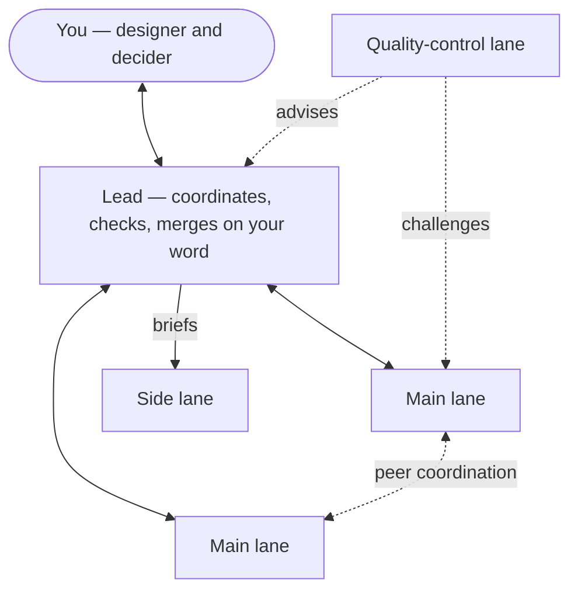

<p align="center">
  <picture>
    <source media="(prefers-color-scheme: dark)" srcset="convoy-brandkit/logo/svg/convoy-horizontal-color-dark.svg">
    <source media="(prefers-color-scheme: light)" srcset="convoy-brandkit/logo/svg/convoy-horizontal-color-light.svg">
    
  </picture>
</p>

<p align="center"><b>Agent swarm coordination for Claude Code.</b><br>
One lead session, several lane sessions, one destination — moving in formation.</p>

---

Convoy is a Claude Code plugin for running several Claude sessions in parallel on one repository
without them colliding. A **lead** session talks to you, splits the work into **lanes**, reviews
what comes back and brings every decision and merge to you, one at a time. Each lane works on
its own branch with a disciplined execution loop.

## How it works



| Role | Does |
|---|---|
| **Lead** | Logs every message, verifies claims against the code, queues decisions for you one topic at a time, runs a fit checkpoint on each PR, merges only with your explicit approval |
| **Main lane** | Owns contracts (wire shapes, ports, stream layouts) and its features end to end; designs with you in its own session |
| **Side lane** | Executes pre-designed briefs one at a time, so main lanes stay on their core path |
| **Quality-control lane** | Reviews structural plans before code, sweeps merged code, keeps the architecture docs; holds settled decisions, turns unsettled patterns into design questions |

**Principles**

- **Split by contract ownership, not by directory.** A seam has exactly one owner; files do not.
- **You are the only merge authority.** Approval is per PR; a green checkpoint is not approval.
- **No automatic decisions.** Anything beyond mechanical logging waits in a queue for you.
- **Design stays in the lane.** The lead points you to the lane that needs you; it never designs for it.
- **Hold what is settled, question what is not.** Locked decisions are enforced; open ones become questions, never premature rules.

## Skills

| Skill | Use |
|---|---|
| `convoy:set-destination` | Set, update or replace the goal and its done query; cut the work into lanes |
| `convoy:coordination` | Lead, main-lane and side-lane rules: message tags, contracts, decision queue, checkpoint |
| `convoy:quality-control` | The quality-control lane: plan reviews, sweeps, the quality register |
| `convoy:branch-loop` | The per-branch execution loop each executing lane runs |

## Install

Convoy builds on the [`superpowers`](https://github.com/obra/superpowers) plugin
(`branch-loop` runs alongside its planning, TDD and review skills). Install that first, then:

```bash
claude plugin marketplace add nguyenvinhloc1997/convoy
claude plugin install convoy@convoy
```

## Quick start

1. In the session that will be the lead, ask Claude to **set a destination**
   (`convoy:set-destination`). It shapes a goal with a checkable done query, pulls the work,
   and proposes a lane table for your approval.
2. Open one Claude Code session per lane and paste the kickoff message the lead drafts.
3. Work with the lead: answer decisions as they come, design with lanes in their own sessions,
   approve merges.

Per-project state lives in `<main checkout>/.convoy/` — git-ignored and shared by every lane's
worktree: `destination.md`, `manifest.md` (lead only), `quality-register.md` (quality-control
only, carried across destinations) and `archive/`.

## Brand

Logos, icon, favicon, social card, color tokens and fonts are in
[`convoy-brandkit/`](convoy-brandkit/) — start with the
[guidelines](convoy-brandkit/Convoy-Brand-Guidelines.pdf).

## Updating

After editing a skill: bump `version` in `.claude-plugin/plugin.json` and
`.claude-plugin/marketplace.json`, commit and push, then
`claude plugin marketplace update convoy && claude plugin update convoy@convoy` and restart sessions.
