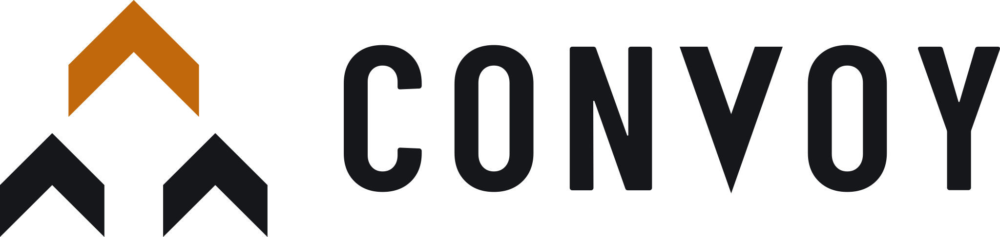
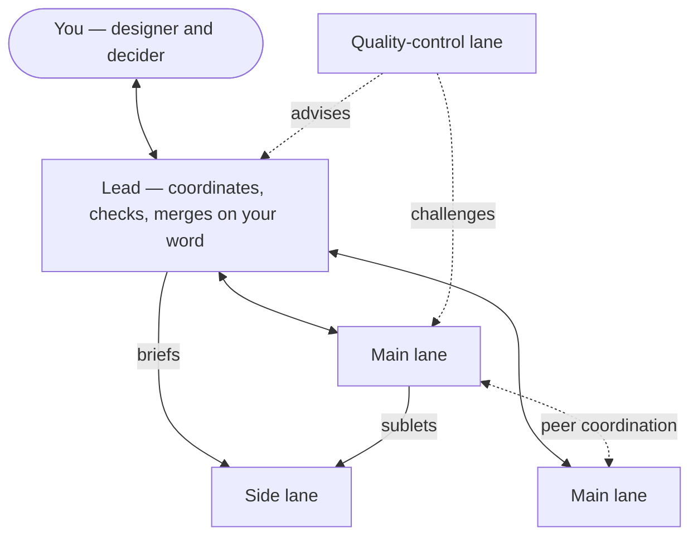

<p align="center">
  <picture>
    <source media="(prefers-color-scheme: dark)" srcset="convoy-brandkit/logo/svg/convoy-horizontal-color-dark.svg">
    <source media="(prefers-color-scheme: light)" srcset="convoy-brandkit/logo/svg/convoy-horizontal-color-light.svg">
    
  </picture>
</p>

<p align="center"><b>Agent swarm coordination for Claude Code.</b><br>
One lead session, several lane sessions, one destination — moving in formation.</p>

<p align="center"><code>BETA · v0.3</code></p>

---

> [!WARNING]
> **Convoy is in beta.** The skills, message tags and `.convoy/` file layout are still changing
> between versions, and it has been run on one real project so far. Expect rough edges, and pin a
> version if you depend on its current behaviour.

Convoy is a Claude Code plugin for running several Claude sessions in parallel on one repository
without them colliding. A **lead** session talks to you, splits the work into **lanes**, reviews
what comes back and brings every decision and merge to you, one at a time. Each lane works on
its own branch with a disciplined execution loop.

## How it works



| Role | Does |
|---|---|
| **Lead** | Logs every message, verifies claims against the code, queues decisions for you one topic at a time, runs a fit checkpoint on each PR, merges only with your explicit approval |
| **Main lane** | Owns contracts (wire shapes, ports, stream layouts) and its features end to end; designs with you in its own session |
| **Side lane** | Runs one task at a time — a task a main lane sublets from its locked plan, or a READY board item it pulls — and never designs |
| **Quality-control lane** | Owns cross-cutting architecture design; reviews structural plans before code, sweeps merged code, watches code growth, keeps the architecture docs; holds settled decisions, turns unsettled patterns into design questions |

**Principles**

- **Split by contract ownership, not by directory.** A seam has exactly one owner; files do not.
- **You are the only merge authority.** Approval is per PR; a green checkpoint is not approval.
- **No automatic decisions.** Anything beyond mechanical logging waits in a queue for you.
- **Design stays in the lane.** The lead points you to the lane that needs you; it never designs for it.
- **Hold what is settled, question what is not.** Locked decisions are enforced; open ones become questions, never premature rules.
- **No lane sits idle.** All work lives on one board; idle lanes pull READY items, and busy main lanes sublet planned tasks to side lanes while keeping the design.
- **Retire before you add.** Every new mechanism names what it supersedes; every PR reports `Retired:`, `Size:` and `Tests removed:`.

## Skills

| Skill | Use |
|---|---|
| `convoy:set-destination` | Set, update or replace the goal and its done query; cut the work into lanes |
| `convoy:coordination` | Lead, main-lane and side-lane rules: message tags, contracts, the board and pull rule, subletting, checkpoint |
| `convoy:quality-control` | The quality-control lane: plan reviews, sweeps, the quality register |
| `convoy:branch-loop` | The per-branch execution loop each executing lane runs |

## Install

Convoy builds on the [`superpowers`](https://github.com/obra/superpowers) plugin
(`branch-loop` runs alongside its planning, TDD and review skills). Install that first, then:

```bash
claude plugin marketplace add nguyenvinhloc1997/convoy
claude plugin install convoy@convoy
```

## Quick start

1. In the session that will be the lead, ask Claude to **set a destination**
   (`convoy:set-destination`). It shapes a goal with a checkable done query, pulls the work,
   and proposes a lane table for your approval.
2. Open one Claude Code session per lane and paste the kickoff message the lead drafts.
3. Work with the lead: answer decisions as they come, design with lanes in their own sessions,
   approve merges.

Per-project state lives in `<main checkout>/.convoy/` — git-ignored and shared by every lane's
worktree, one job per file: `destination.md` (goal, done query), `manifest.md` (structure:
lanes, contracts, resources), `board.md` (all work and its state), `log.md` (append-only events),
`quality-register.md` (quality-control only, carried across destinations) and `archive/`. The
lead writes the manifest, board and log; lanes change them by message.

## Example lane setup

A trading app with a market-data ingest, an order engine, an HTTP API and a separate frontend
repo. Destination: *"ship every open issue on the `Alpha` milestone"* — done query
`gh issue list --milestone Alpha --state open --limit 200`.

| Lane | Kind | Session | Owns (contracts) | Works on |
|---|---|---|---|---|
| **Lead** | lead | `Coordinator` | the manifest, merge order | decisions, checkpoints, merges |
| **L1** | main | `L1-Feed` | the market-data stream layout, feed-gap ports | ingest bugs, feed recovery |
| **L2** | main | `L2-Engine` | engine order/ack types, the event log | matching, fills, engine performance |
| **L3** | side | `L3-Side` | — | sublet tasks from main lanes; READY board items |
| **L4** | main | `L4-API` | REST/SSE response shapes, order routes | API endpoints, error codes, user-facing copy |
| **L5** | main | `L5-Frontend` | — (consumes L4's shapes) | frontend repo, one worktree per PR |
| **QC** | quality | `QC-Architecture` | the quality register | plan reviews, merged-code sweeps |

A typical slice of traffic:

```text
L4 → Lead   CONTRACT L4: POST /orders returns 200 {results:[…]} for per-item rejects (was 4xx)
Lead → L5   relays it; L5 checks its own call sites, replies ACK
L4 → L1,L2  TOUCH L4: editing cache/keys.py (new per-account order index) — reply on conflict
L2 → L4     no conflict; condition: index must be rebuilt on cold restore
QC → L4     CHALLENGE QC: index has no retention rule — terminal orders grow unbounded
L4 → Lead   PR-READY L4: #737 @6f611a6f · closes #697 #711 · Filed: #735, #736
Lead → You  #737 + frontend #258 pass the checkpoint (lockstep). Merge?
You → Lead  yes
Lead → all  REBASE: staging is now b4caca3f
```

A kickoff the lead drafts for one lane:

```text
Lane L1-Feed (main). Lead: Coordinator. Manifest: <repo>/.convoy/manifest.md
Owns: market-data stream layout; feed-gap ports.
Issues, in order: #607 → #608 → #611 → #613
Known seams: the stream entry layout is consumed by L2 (send CONTRACT before changing it).
Load convoy:coordination and convoy:branch-loop.
```

## Brand

Logos, icon, favicon, social card, color tokens and fonts are in
[`convoy-brandkit/`](convoy-brandkit/) — start with the
[guidelines](convoy-brandkit/Convoy-Brand-Guidelines.pdf).

## Updating

After editing a skill: bump `version` in `.claude-plugin/plugin.json` and
`.claude-plugin/marketplace.json`, commit and push, then
`claude plugin marketplace update convoy && claude plugin update convoy@convoy` and restart sessions.

## License

[MIT](LICENSE). The fonts in `convoy-brandkit/fonts/` are under the SIL Open Font License
([details](convoy-brandkit/fonts/LICENSE.txt)).
